# Railway_reservation_system
This is repositary of the railway reservation system developed  using gui in c++ language.
I have also used mysql database server for dataconection.

mainpage of the program looks like this

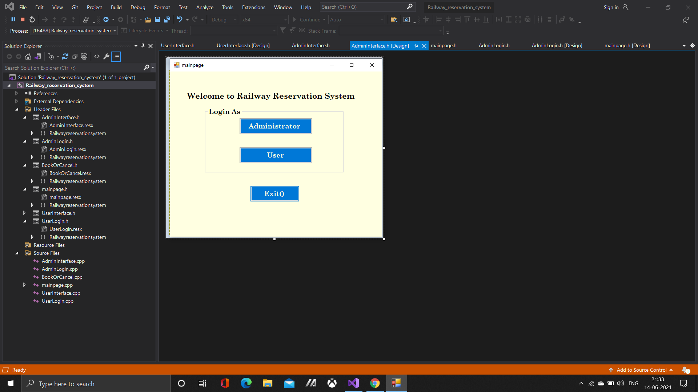

It has two seperate interface one is for administrator and other is for all other users.

Administrator login page looks like this 

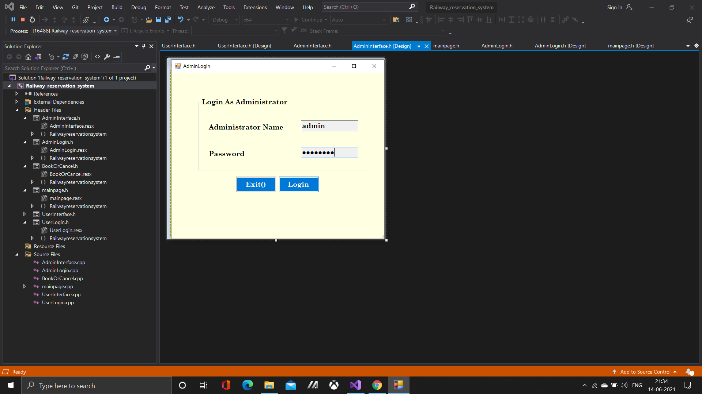

 In Admin userinterface we can add and update data in our data base
 I already mentioned that i have used mysql database system while making this project.
 
 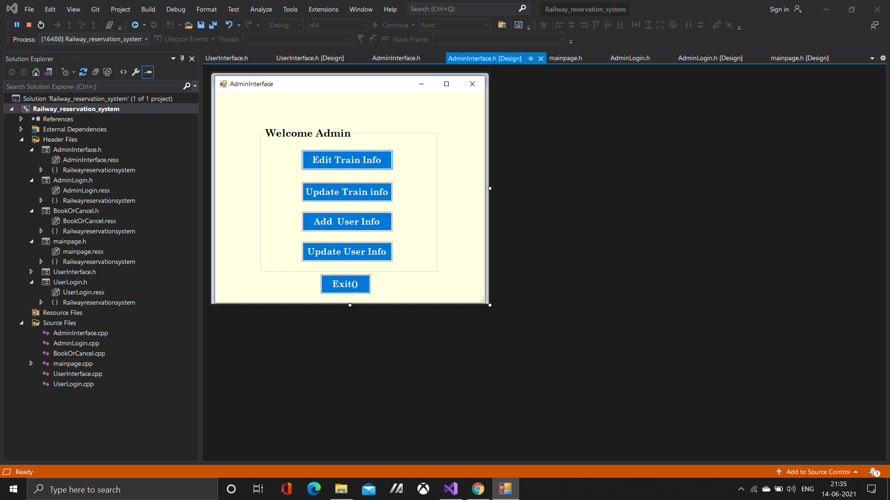
 
 So fisrt add new train information to our database
 
 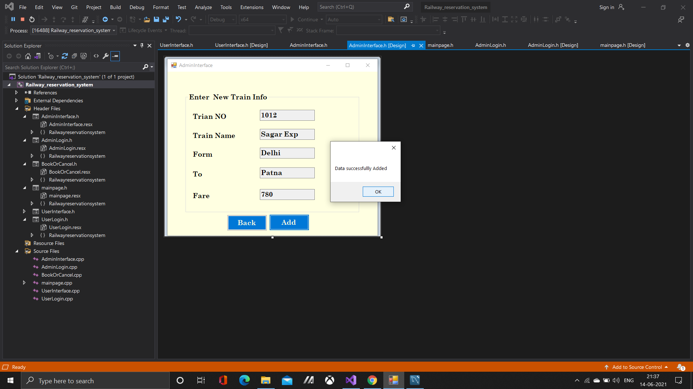
 
 Now updating existing train information in our database
 
 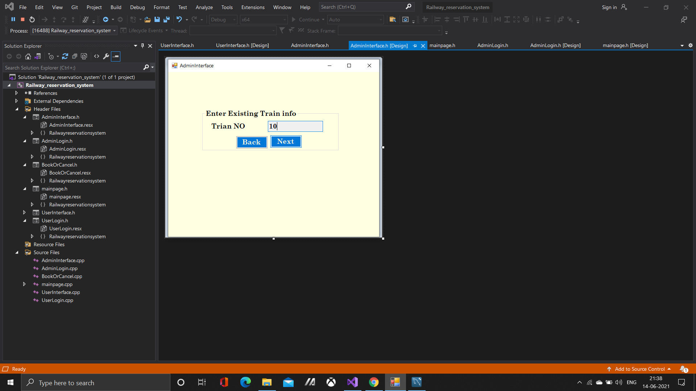
 
 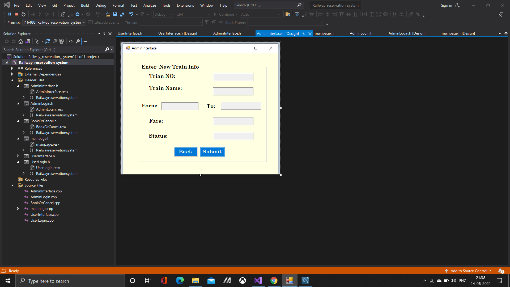
 
 Adding new user  information to our database.
 
 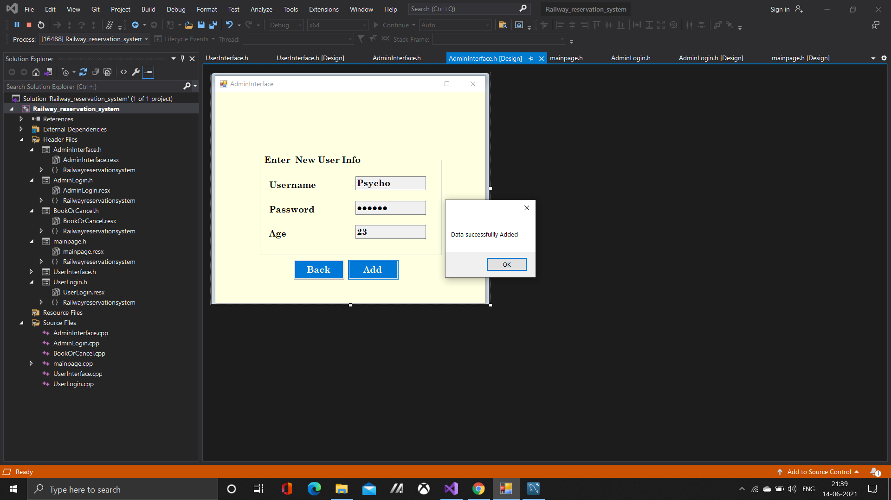
 
 Now updating Existing user information such as changing username or password.
 
 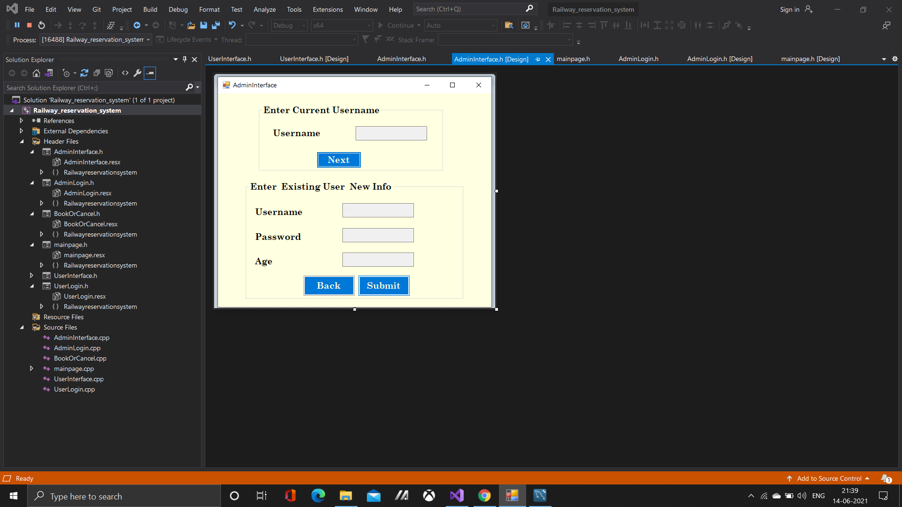
 
 Now let's move toward  user interface in our application so
 
 fisrt of all user Interface also have a login page at first when you open 
 
 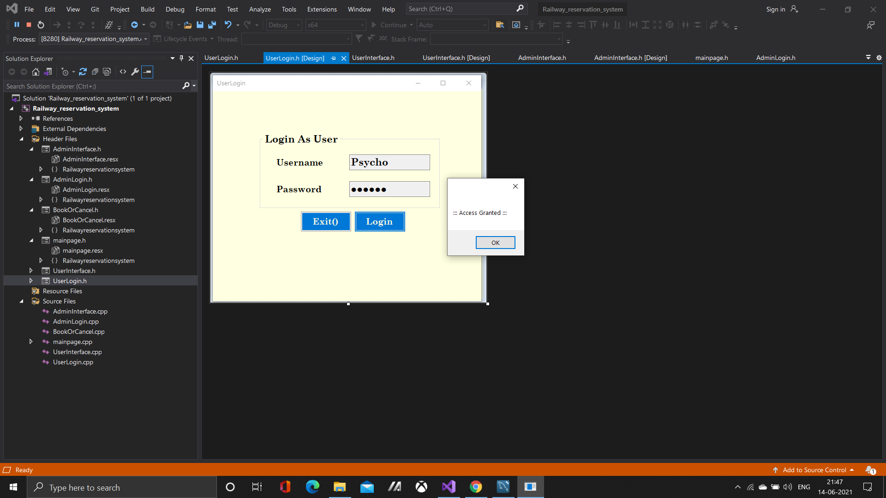
 
 after that you have entered into userinterface and that look's like that.
 
 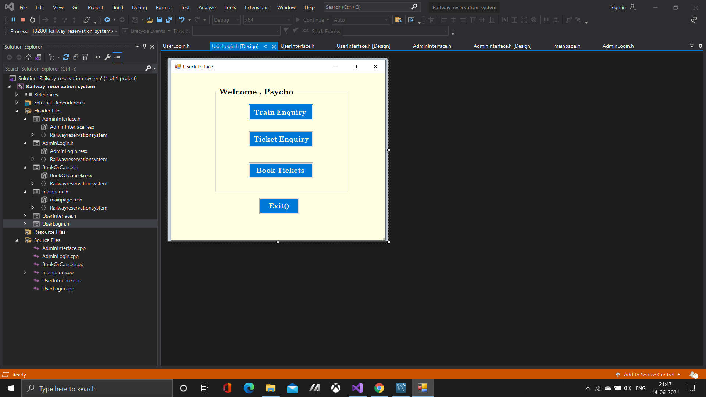
 
 first we have a train Enquiry button which perform an train search.
 
 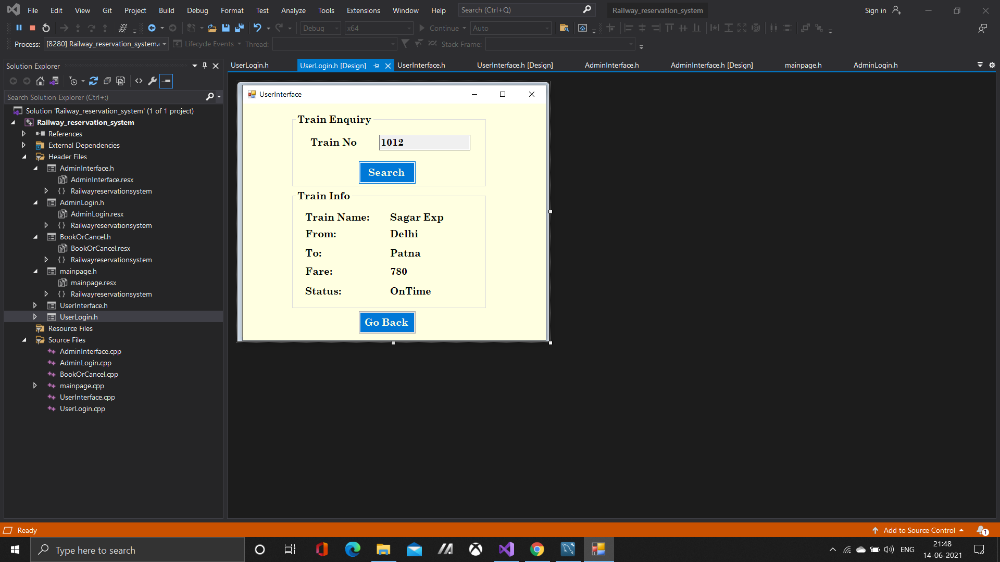
 
 then we have button for ticket Enquiry and also be used for cancelling of the ticket.
 
 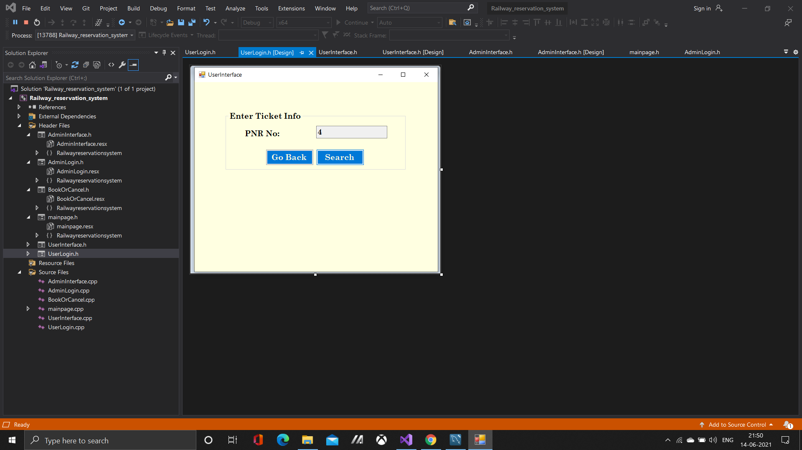
 
 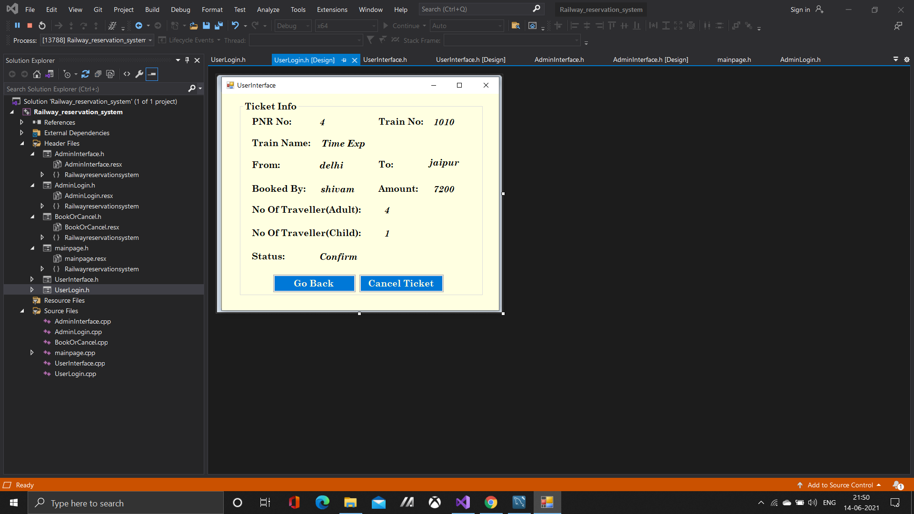
 
 then we have a button to perform the booking function.
 
 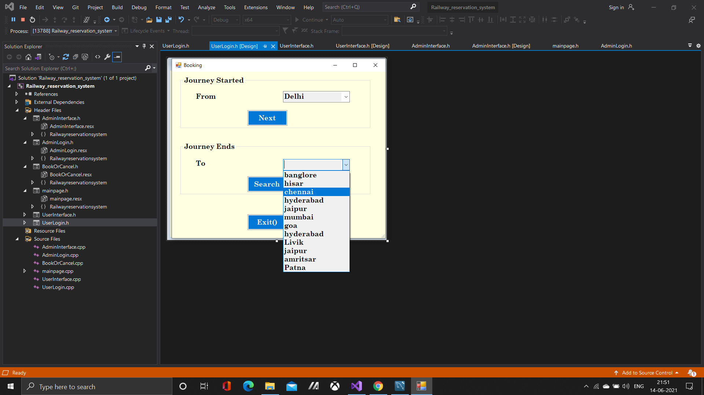
 
 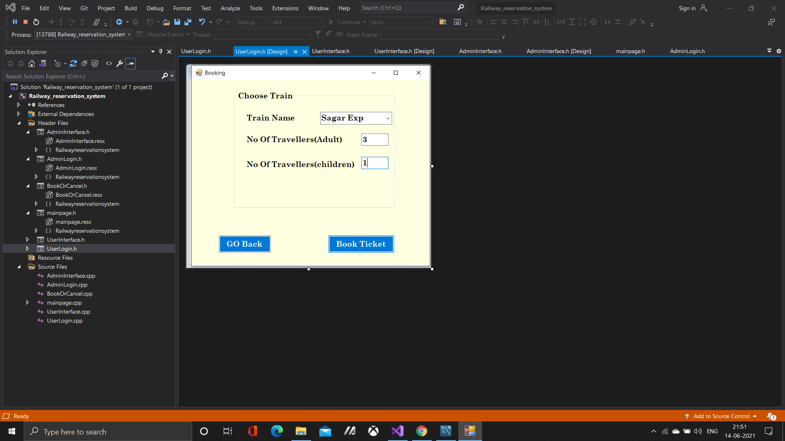
 
 And then at last our booked ticket detatils has been displayed.
 
 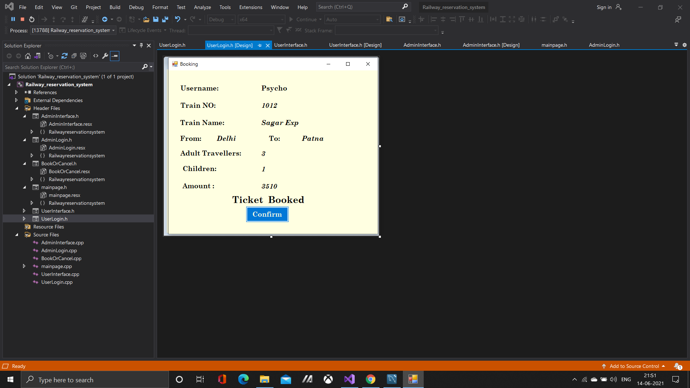
 
 
 This all about this small project .
 I hope you liked it.
